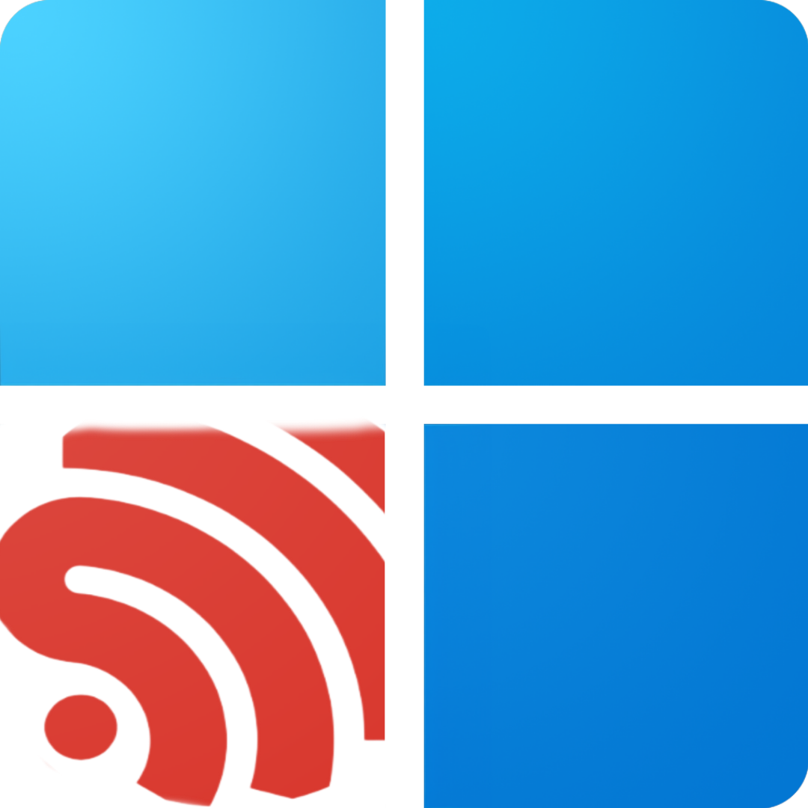
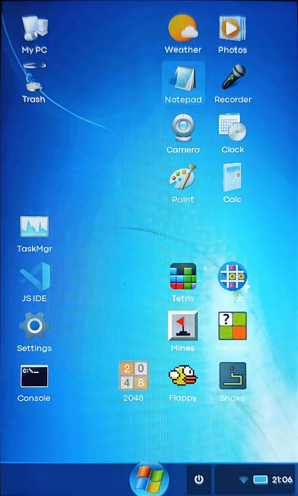
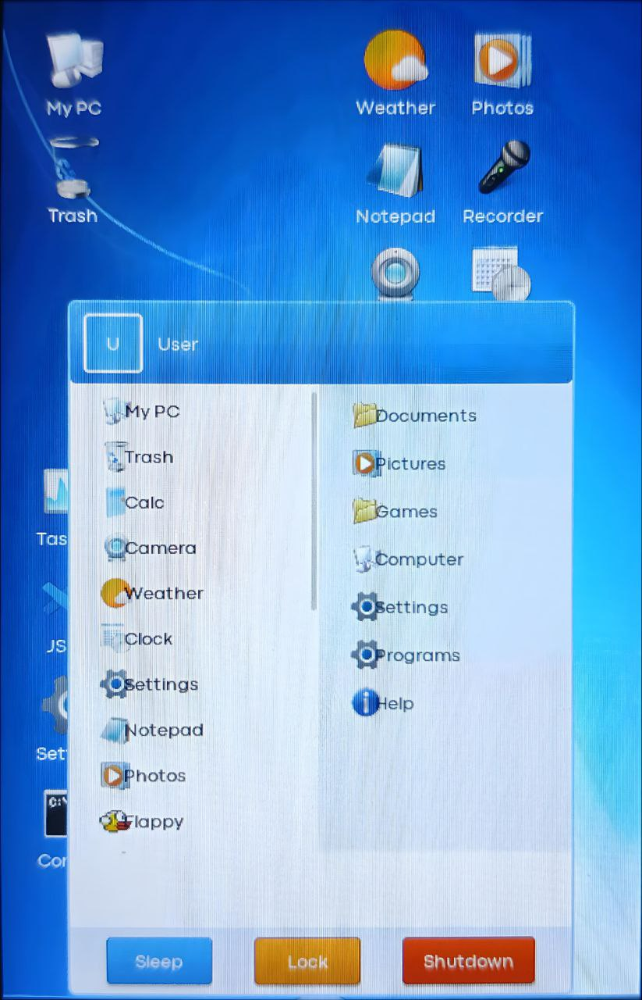
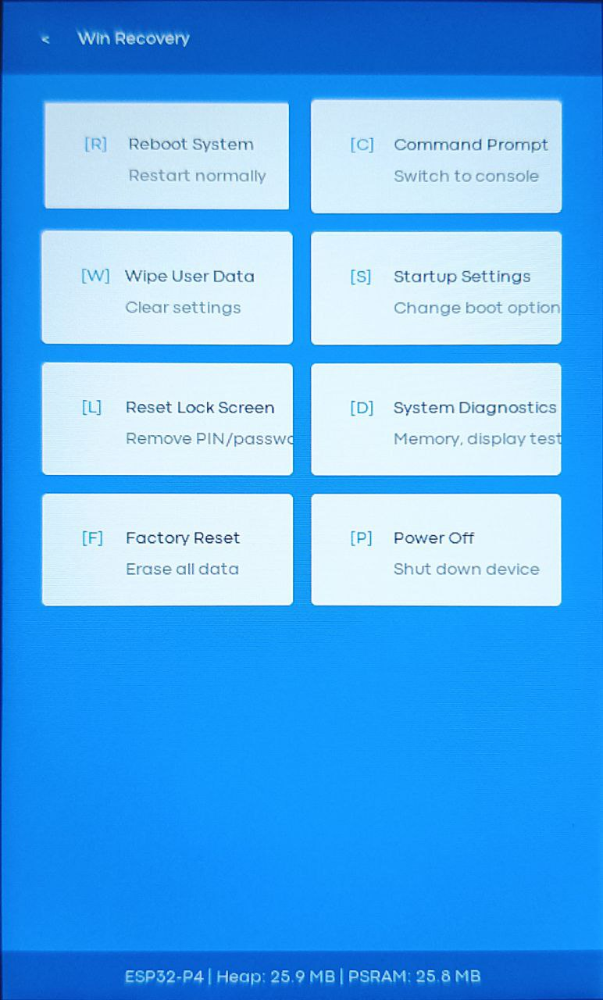
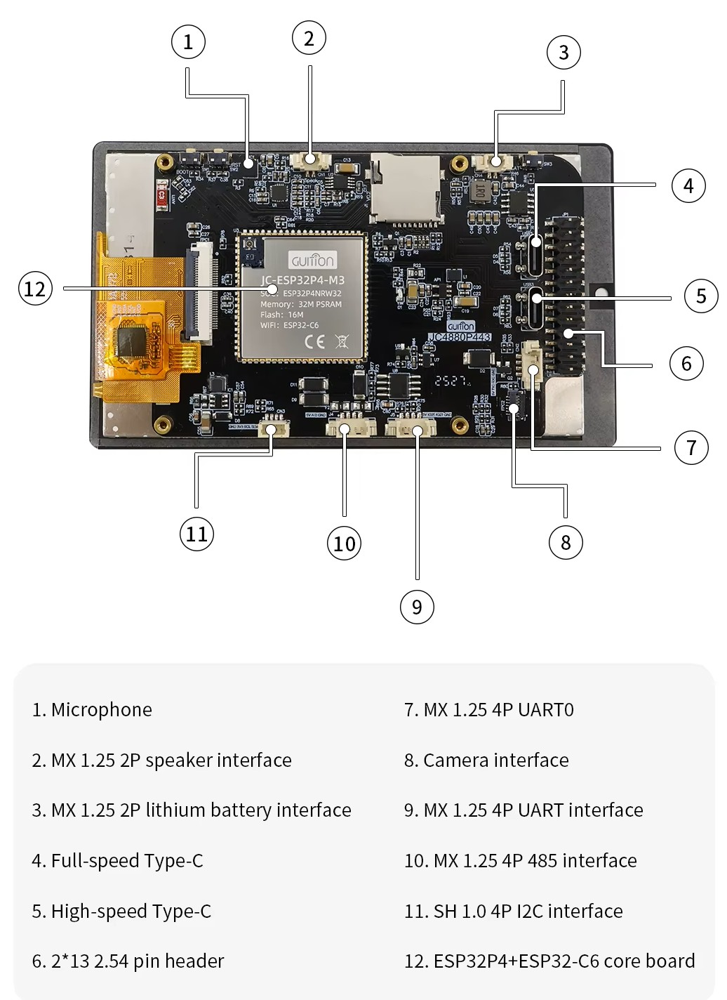

<p align="center">
  
</p>

<h1 align="center">WinESP32</h1>

<p align="center">
  <b>Windows Vista/7 Style Operating System for ESP32-P4</b>
</p>

<p align="center">
  
  
  
  
  
</p>

<p align="center">
  
  
</p>

---

## About & Warning

WinESP32 is a retro-style operating system inspired by Windows Vista/7 for ESP32-P4 microcontroller with 480x800 touchscreen display. This is an experimental hobby project, not intended for production use.

# This project just funny coded shit (Yeah AI helped me to make this shit less lagging), If you wanna DM me or help with code, use telegram - [](https://t.me/ewinnery)

### Features

- Desktop with draggable icons
- Start menu with Win7/WinXP/Win11 themes
- System tray (WiFi, Bluetooth, battery indicators)
- 6 wallpapers (XP, Vista, 7, 8, 10, 11)
- Lock screen with AOD mode
- Recovery mode for system restore
- File manager (LittleFS + SD card)
- Camera support (MIPI-CSI)

---

## Applications

### Utilities
| App | Description |
|-----|-------------|
| Calculator | Basic calculator |
| Clock | Clock with alarms |
| Weather | Weather app (OpenWeatherMap API) |
| Notepad | Text editor with file save/load |
| Paint | Simple drawing app |
| Camera | Camera app (OV02C10) |
| Photo Viewer | Image viewer (JPEG/PNG/BMP) |
| File Manager | Browse LittleFS and SD card |
| Voice Recorder | Audio recorder (requires external mic) |
| Task Manager | System monitor (WIP) |
| Console | Command line interface |
| JS IDE | JavaScript IDE (Duktape engine) |
| Settings | System configuration |

### Games
| Game | Description |
|------|-------------|
| Snake | Classic snake game |
| Flappy Bird | Flappy Bird clone |
| Tetris | Tetris |
| 2048 | 2048 puzzle |
| Minesweeper | Minesweeper |
| Tic-Tac-Toe | Tic-Tac-Toe |
| Memory | Memory matching game |

---

## Settings

| Section | Options |
|---------|---------|
| WiFi | Scan, connect, save networks |
| Bluetooth | Enable/disable, device name |
| Personalization | UI theme (Win7/XP/11), wallpaper, desktop grid |
| Keyboard | Height, theme (light/dark) |
| Brightness | Backlight adjustment (not working) |
| Time | Timezone, 24h format |
| Region | City for weather |
| User | Name, avatar, password |
| Storage | Memory info |
| Apps | Installed apps list |
| About | System info |

---

## Recovery Mode

<p align="center">
  
</p>

Recovery mode allows system restore when something goes wrong.

### How to enter:
1. **3 Times boot:** Press boot button for 3 times (im idk how to use boot button fr, so not working)
2. **From lock:** When you in lock screen, tap the left up corner 3 times, it will appear a message to boot
3. **From system:** When you in system, go to setings > about > press 3 times ESP-IDF version

### Recovery options:
- Reboot to normal mode
- Factory reset data (config reset)
- System info (memory, version simple test) 
- Console (idk why)

---

## Supported Hardware

### Recommended Board

<table>
<tr>
<td width="200">

</td>
<td>

**JC4880P443C-I-W-Y** (recommended)

[Buy on AliExpress](https://aliexpress.ru/item/1005009673625472.html?sku_id=12000049827362735&spm=a2g2w.productlist.search_results.1.455c274eXRvMJC)

| Spec | Value |
|------|-------|
| MCU | ESP32-P4 (400MHz dual-core RISC-V) |
| WiFi/BT | ESP32-C6 (via ESP-Hosted) |
| Display | 4.0" 480x800 IPS (ST7701S MIPI-DSI) |
| Touch | GT911 (capacitive, I2C) |
| Camera | OV02C10 2MP (MIPI-CSI) |
| Flash | 16MB |
| PSRAM | 32MB (200MHz) |
| SD card | microSD slot |

</td>
</tr>
</table>

### Board Variants

| Model | What's included | Camera | WiFi/BT |
|-------|-----------------|--------|---------|
| JC4880P443C-**I-W-Y** | Board + display + camera + case | OV02C10 | ESP32-C6 |
| JC4880P443C-**I-W** | Board + display only | No | ESP32-C6 |

> **Note:** Neither variant includes a battery. The "-Y" suffix means camera module and plastic case are included.

### Camera Support

| Camera | Interface | Resolution | Status |
|--------|-----------|------------|--------|
| OV02C10 | MIPI-CSI | 1288x728 | Supported (only in I-W-Y variant) |

---

## Quick Start

### Flash Pre-built Firmware

1. Download files from `firmware/` folder
2. Install [esptool](https://github.com/espressif/esptool) or ESP Flash Tool
3. Flash:

```bash
esptool.py --chip esp32p4 -p COM3 -b 921600 write_flash \
  0x0 bootloader.bin \
  0x8000 partition-table.bin \
  0x10000 win32_os.bin
```

### Build from Source

Requirements:
- [ESP-IDF v5.4.3](https://docs.espressif.com/projects/esp-idf/en/v5.4.3/esp32p4/get-started/)
- Python 3.8+ with Pillow

```bash
git clone https://github.com/user/WinESP32.git
cd WinESP32

# Build
build.bat

# Flash
flash.bat

# Monitor
monitor.bat
```

---

## Project Structure

```
RWinESP32/
├── main/                    # Source code
│   ├── ui/                  # UI components
│   │   ├── win32_ui.cpp     # Desktop, taskbar, windows
│   │   ├── apps.cpp         # All applications
│   │   ├── system_tray.cpp  # System tray
│   │   └── settings_extended.cpp
│   ├── hardware/            # HAL drivers
│   ├── main.cpp             # Entry point
│   ├── lvgl_port.cpp        # LVGL initialization
│   ├── system_settings.cpp  # Settings (NVS)
│   ├── weather_api.cpp      # Weather HTTP client
│   ├── bluetooth_transfer.cpp
│   └── recovery_*.cpp       # Recovery mode
├── components/              # External components
│   ├── lvgl/                # LVGL v9
│   ├── drivers/             # ST7701, GT911
│   ├── duktape/             # JavaScript engine
│   └── esp_cam_sensor/      # Camera driver
├── assets/converted/        # Compiled icons (.c files)
├── utils/                   # Development utilities
│   ├── convert_assets.py    # PNG to C converter
│   └── raw/                 # Source icons
├── firmware/                # Pre-built binaries
├── imgs/                    # Screenshots
├── CMakeLists.txt
├── partitions.csv
├── sdkconfig.defaults
└── README.md
```

---

## Known Issues

> **Warning:** This is an alpha release. Many features are incomplete or broken.

| Issue | Severity | Description |
|-------|----------|-------------|
| System lag | High | UI stutters and lags during navigation |
| UI layout bugs | High | Text overlapping, buttons misaligned in several places |
| Animation performance | Medium | Animations are not smooth, need optimization |
| Bluetooth not working | High | Bluetooth functionality is completely broken |
| Camera distortion | Medium | Camera stretches faces horizontally |
| Photo viewer crash | High | Photo viewer breaks when rotating or zooming images |
| Task Manager | Medium | Task Manager is incomplete, still in development |
| SD card untested | Medium | SD/TF card support has not been properly tested |
| Brightness control | High | Screen brightness adjustment does not work |
| Battery percentage | High | Battery level detection is broken/inaccurate |

---

## TODO

- [ ] Fix system performance and reduce lag
- [ ] Fix UI layout issues across all apps
- [ ] Optimize animations
- [ ] Fix Bluetooth functionality
- [ ] Fix camera aspect ratio
- [ ] Fix photo viewer rotation/zoom
- [ ] Complete Task Manager
- [ ] Test and fix SD card support
- [ ] Implement working brightness control
- [ ] Fix battery level detection
- [ ] Add full Cyrillic font support
- [x] Add AI Client
- [ ] Add video player
- [ ] Add more games
- [ ] Implement OTA updates


---

## Utils

### Convert Icons

```bash
cd utils
python convert_assets.py
```

Supported formats: PNG, JPG, BMP

Sizes:
- App icons: 48x48
- System icons: 20x20
- Wallpapers: 240x400 (scaled)

---

## License

MIT License

---

## Credits

- [LVGL](https://lvgl.io/) - Graphics library
- [ESP-IDF](https://github.com/espressif/esp-idf) - Espressif framework
- [Duktape](https://duktape.org/) - JavaScript engine

---

<p align="center">
  <a href="https://github.com/user/WinESP32/issues">Report Bug</a> •
  <a href="https://github.com/user/WinESP32/discussions">Discussions</a>
</p>
